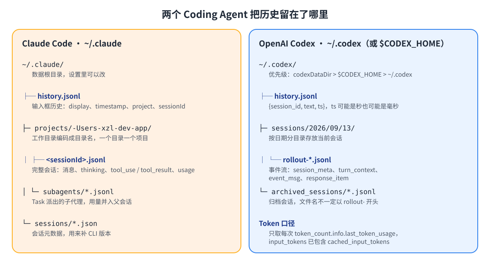
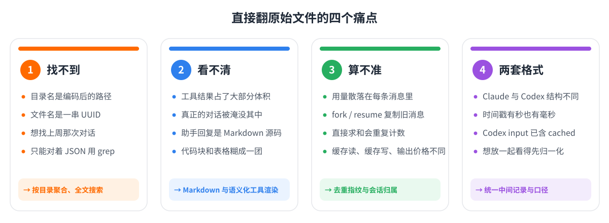
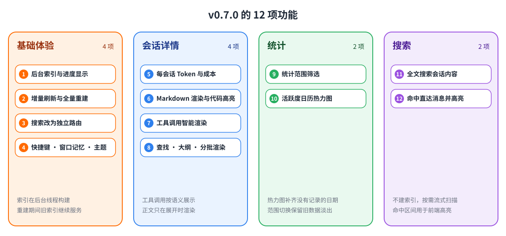
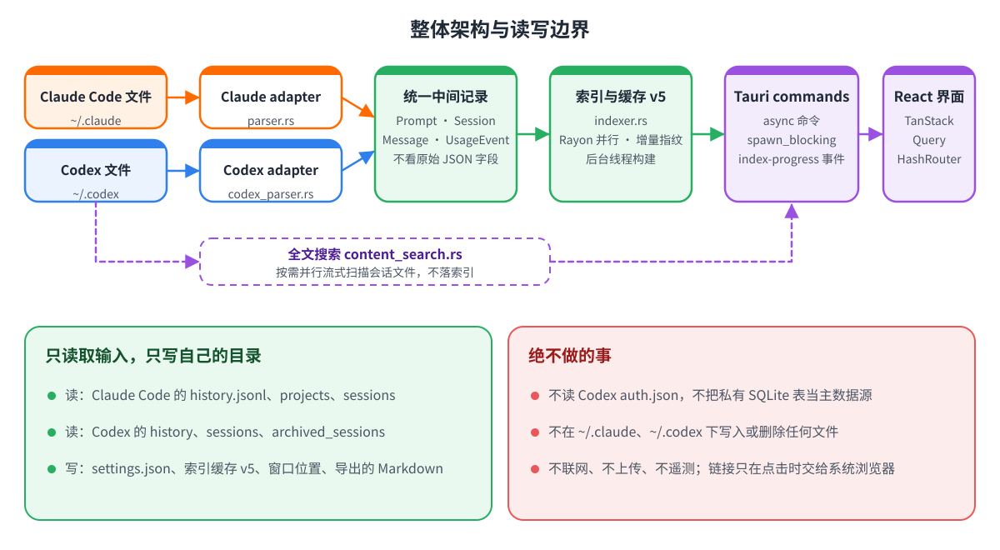
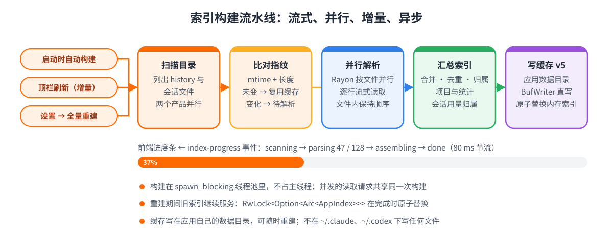
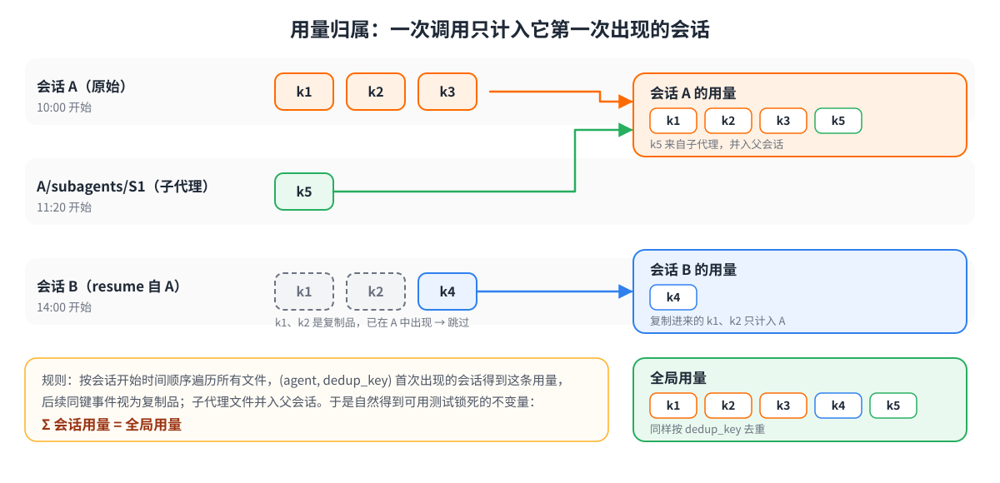
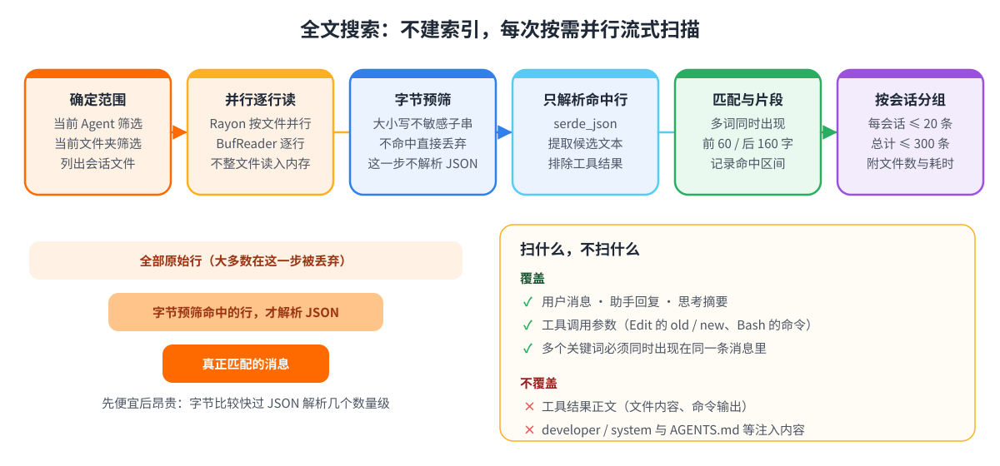

@[TOC]
> 🍃作者介绍：AI 应用负责人/AI产品架构师，阿里云专家博主。专注 LLM 应用开发、Agent 系统设计、具身智能与工业 AI 落地。日常在大模型训练、Coding Agent 工具链、AI 产品商业化等方向持续输出实战内容。
> 🦅个人主页：[@逐梦苍穹](https://blog.csdn.net/qq_60735796?spm=1010.2135.3001.5421)
> 🐼GitHub主页：[https://github.com/XZL-CODE](https://github.com/XZL-CODE)
> ✈ 您的一键三连，是我创作的最大动力🌹

# 1、前言

用 Claude Code 或 Codex 写了几个月代码之后，`~/.claude` 和 `~/.codex` 里会攒下成百上千个 JSONL 文件。你说过的每一句话、模型的每一段思考、每一次工具调用、每一次 Token 消耗，都原封不动地躺在里面。

问题是，这些文件是写给程序读的，不是写给人看的。目录名是编码过的路径，文件名是一串 UUID，单个文件动辄几十 MB，真正的对话被工具结果淹没在文件内容和命令输出里。想回答「上周我是怎么让它修那个 bug 的」「这个项目到底花了多少钱」「它当时改了哪几个文件」，基本只能靠 grep。

Coding Agent History Viewer 就是为这件事写的：一个本地、只读的桌面应用，扫描 Claude Code 与 Codex 的历史文件，按工作目录整理 Prompt、会话、工具调用和 Token 用量。它不联网、不上传、不碰认证文件，索引只写在自己的数据目录里。

刚发布的 v0.7.0 是这个项目到目前为止改动最大的一个版本：59 个文件、约 7000 行新增，12 项功能覆盖四个方向：

- **基础体验**：索引搬到后台线程并显示进度，刷新改为增量，搜索变成独立路由，加上快捷键、窗口记忆和跟随系统的主题。
- **会话详情**：Markdown 渲染与代码高亮，工具调用按语义展示，会话内查找与轮次大纲，每个会话的 Token 与成本。
- **统计**：概览支持时间范围筛选，活跃度改为日历热力图。
- **搜索**：全文搜索会话内容，命中直接跳到对话里的那条消息。

这篇文章分两条线。前半部分讲「它能帮你做什么」，装好就能用；后半部分讲「它是怎么做到的」，包括几个我认为值得说清楚的取舍：为什么全文搜索不建索引，怎样让「各会话成本之和等于全局总量」，以及索引异步化到底改了什么。

> 仓库地址：[https://github.com/XZL-CODE/cc-history-viewer](https://github.com/XZL-CODE/cc-history-viewer)
> 下载地址：[Releases · v0.7.0](https://github.com/XZL-CODE/cc-history-viewer/releases/tag/v0.7.0)

# 2、快速上手

## 2.1 下载与安装

安装包由 GitHub Actions 自动构建，直接在 Release 页面下载：

| 平台 | 文件 | 说明 |
|---|---|---|
| macOS（Apple Silicon 与 Intel 通用） | `Coding.Agent.History.Viewer_0.7.0_universal.dmg` | 拖进「应用程序」即可 |
| Windows | `Coding.Agent.History.Viewer_0.7.0_x64-setup.exe` | NSIS 安装包；另有同版本 `.msi` 可选 |

应用目前没有做代码签名，首次打开会遇到系统的拦截提示，处理方式如下：

- **macOS**：若提示「已损坏」或「无法验证开发者」，在 Finder 中右键「打开」，或在终端执行：

```bash
xattr -cr "/Applications/Coding Agent History Viewer.app"
```

- **Windows**：SmartScreen 弹窗时点「更多信息」，再点「仍要运行」。

想从源码运行也很简单，需要 Node.js 18+、pnpm 8+ 和 Rust 工具链：

```bash
git clone https://github.com/XZL-CODE/cc-history-viewer.git
cd cc-history-viewer
pnpm install
pnpm tauri dev
```

## 2.2 第一次打开

应用启动后会自动读取两个产品的默认数据目录：

| 产品 | 读取内容 |
|---|---|
| Claude Code | `~/.claude/history.jsonl`、`~/.claude/projects/**/*.jsonl`、`~/.claude/sessions/*.json` |
| OpenAI Codex | `~/.codex/history.jsonl`、`sessions/YYYY/MM/DD/rollout-*.jsonl`、`archived_sessions/*.jsonl`；根目录优先取设置中的 `codexDataDir`，其次环境变量 `CODEX_HOME`，最后 `~/.codex` |

第一次会建立索引，顶栏会显示「正在扫描数据目录 → 正在解析 x / y 个文件 → 正在汇总索引」的进度。索引缓存写在应用自己的数据目录里，之后每次启动只重新解析有变化的文件。只装了其中一个产品也没关系，另一个目录不存在不影响使用。

如果你的历史不在默认位置，按 ⌘/Ctrl + `,` 打开设置，分别填写 Claude 与 Codex 的数据目录。设置页会显示每个路径解析后的实际位置和是否存在，保存后自动重建索引。设置底部还有「索引维护」：日常用「增量刷新」，怀疑缓存有问题时用「全量重建」。

<!-- 📸 截图 3：设置弹窗。展示 Claude / Codex 数据目录输入框、「解析后的实际路径」与「存在」状态，以及底部的「索引维护」区域（增量刷新 / 全量重建）。 -->


## 2.3 三分钟看懂界面

- **左侧栏**：「首页 · 概览」「导出 Prompt」，以及按工作目录聚合的文件夹列表，每个文件夹显示 Prompt 数与会话数，顶部可以筛选文件夹。
- **顶栏**：搜索框（⌘/Ctrl + K）、「命令」开关（是否显示 `/resume`、`/model` 这类斜杠命令）、增量刷新、语言、主题、设置。
- **首页**：先选 Coding Agent 数据范围（Claude Code / Codex / 全部），再选统计范围；下面依次是概览卡片、活跃度日历、24 小时分布、星期分布、活跃文件夹、Token 用量与成本、最近的 Prompt。
- **文件夹页**：两个标签，「Prompt 列表」和「会话」。会话可以按最新 / 成本 / 消息数 / 时长排序。
- **对话详情**：完整的消息流，右侧是用户轮次大纲，顶部有查找、全部展开 / 折叠、Markdown / 原文切换、导出 Markdown 和复制 Resume 命令。

<!-- 📸 截图 1：首页概览上半部分。包含顶部的 Agent 筛选、「统计范围」行（建议选中「近 30 天」）、概览卡片和「活跃度日历」热力图。浅色或深色主题均可。 -->


## 2.4 常用快捷键

| 快捷键 | 作用 |
|---|---|
| ⌘/Ctrl + K | 聚焦搜索框 |
| Esc | 清空搜索并返回上一页 / 关闭设置 |
| ⌘/Ctrl + R、F5 | 增量刷新本地数据 |
| ⌘/Ctrl + `,` | 打开设置 |
| ⌘/Ctrl + F（对话详情内） | 会话内查找，Enter / Shift + Enter 切换命中 |

# 3、背景：为什么值得为历史文件写一个查看器

## 3.1 两个 Coding Agent 把什么留在了本机



**Claude Code** 把数据放在 `~/.claude`：

- `history.jsonl` 是输入框历史，每行一条 `display`、`timestamp`、`project`、`sessionId`，也就是你敲过的每一句话。
- `projects/<编码后的工作目录>/<sessionId>.jsonl` 是完整会话：user / assistant / system 三种行，内容块里有文本、thinking、tool_use 和 tool_result，每条 assistant 消息自带 `usage`（`input_tokens`、`cache_read_input_tokens`、`cache_creation_input_tokens`、`output_tokens`），还有模型、CLI 版本和父消息指针。用 Task 派出去的子代理会写到 `subagents/` 子目录。
- `sessions/*.json` 是会话元数据，主要用来补 CLI 版本。

**Codex** 的结构完全不同。`history.jsonl` 每行只有 `session_id`、`text`、`ts`，而且 `ts` 有的版本是秒、有的版本是毫秒。完整会话是 `sessions/YYYY/MM/DD/rollout-*.jsonl` 里的事件流：`session_meta` 给出会话 ID、`cwd` 和 CLI 版本，`turn_context` 给出当前模型，`event_msg` 里既有真实的用户消息也有 `token_count`，`response_item` 里是助手消息和工具调用。Token 只能取每次 `token_count.info.last_token_usage`，而且 `input_tokens` 已经包含了 `cached_input_tokens`。

两边共同的特点是：**它们是日志，不是文档**。信息很全，但没有一处是为「人来翻阅」设计的。

## 3.2 直接翻原始文件的四个痛点



1. **找不到**。目录名是把工作目录里的 `/` 等符号都换成 `-` 之后的样子，文件名是 UUID。想找「上周关于某个 bug 的那次对话」，只能在几百个文件里 grep 关键词，然后对着一行几千字符的 JSON 猜是哪一句。
2. **看不清**。一个会话文件里，工具结果（`cat` 出来的文件、命令输出、搜索结果）往往占了大部分体积，真正的对话被淹没在中间；助手回复是 Markdown 源码，代码块、表格、列表全糊在一起。
3. **算不准**。Token 用量散落在每一条 assistant 消息里；未缓存输入、缓存读、缓存写、输出四种价格各不相同；`--resume` 或 fork 会把旧消息原样复制进新文件，直接按文件求和会重复计数；子代理还有自己的文件。
4. **两套格式**。Claude Code 与 Codex 的 JSONL 结构、时间戳单位、Token 字段语义都不一样，想放在一起看就得先做一层归一化。

## 3.3 这个工具的设计原则

针对这四个痛点，工具从一开始就定了几条原则，v0.7.0 的所有功能都在这些边界之内：

- **本地、只读、隐私优先**。不联网、不上传、不遥测；不读取 Codex 的 `auth.json`；不在 `~/.claude`、`~/.codex` 下写入或删除任何文件。应用只写自己的设置、索引缓存、窗口位置和用户主动导出的 Markdown。
- **原始文件是唯一事实源**。索引是派生数据，随时可以重建；缓存和原始历史一样按敏感数据对待。
- **口径先说清楚**。统一的用量字段（`uncachedInput`、`cacheRead`、`cacheCreation`、`output`、`reasoningOutput`）、统一的总 Token 公式、统一的缓存命中率公式；未知价格的模型显示「—」而不是 0；Codex 的成本明确标注为「API 等价估算」，不代表订阅账单。
- **宽容解析**。单行损坏只跳过这一行，未知事件直接忽略，缺少模型或 Token 的旧文件仍然可以浏览，任一产品的目录不存在都不算错误。

# 4、v0.7.0 功能详解

先看全貌，12 项功能按四个方向分组：



## 4.1 基础：后台索引、进度显示与增量刷新

0.6.x 有两个用起来很别扭的地方：索引在同步 command 里构建，会占住主线程，历史库一大，首次打开就只能对着一句「正在读取本地数据」干等，没有任何进度；顶栏的刷新按钮名义上是「刷新」，实际走的是全量重解析，每按一次都要把所有文件再读一遍。

0.7.0 把这两件事一起改了：

- 索引在后台线程构建，前端通过 `index-progress` 事件实时显示「扫描 → 解析 x / y → 汇总」三个阶段的进度。
- ⌘/Ctrl + R 和顶栏按钮改为**增量刷新**，只重新解析指纹（文件 mtime + 长度）有变化的文件，完成后提示「索引已更新，重解析 N 个文件」或「本地数据没有变化」。
- **全量重建**移到设置的「索引维护」里，忽略缓存重新解析全部文件，适合解析规则升级或怀疑缓存异常的时候。重建期间旧索引继续服务，不会出现空白页。

<!-- 📸 截图 8（可选）：在设置中点「全量重建」后，顶栏出现的索引进度条（「正在解析 x / y 个文件…」）。历史库小的话进度一闪而过，截不到就跳过。 -->


## 4.2 搜索：独立路由与全文搜索会话内容

搜索现在是一个独立页面 `/search`，关键词、范围（全局 / 当前文件夹）、Agent 和搜索模式都放在 URL 里。从结果点进某个对话，再按返回键，回到的是原来的结果列表而不是首页。

更重要的是新增的**「会话内容」模式**。原来的「Prompt」模式只搜你自己输入过的话；「会话内容」模式会扫描助手回复、思考摘要和工具调用参数，也就是说，你可以搜：

- 助手当时给出的某个函数名或错误信息；
- 它在思考里提到的某个方案；
- Edit 工具的 `old_string` / `new_string`，或 Bash 工具执行过的命令。

命中按会话分组展示，每条命中带角色或类型标签（助手、思考、工具 Edit），显示上下文片段和命中数；点「跳转到该消息并高亮关键词」会打开对话、定位到那条消息，并把关键词预填进会话内查找。结果顶部会告诉你扫描了多少个会话文件、多少个会话命中、耗时多少毫秒。

几个刻意画出的边界：

- **不含工具结果正文**。文件内容和命令输出不参与匹配，否则任何常见词都会命中一堆被 `cat` 出来的源码。
- developer / system 消息和 `AGENTS.md` 这类注入内容不会命中。
- 多个关键词需要同时出现在同一条消息里。
- 每个会话最多返回 20 条、总计最多 300 条，超出会提示缩小范围或增加关键词。

<!-- 📸 截图 4：搜索页切到「会话内容」模式后的结果。建议用一个能命中多个会话的关键词，让画面里同时有「助手」「思考」「工具 Edit」标签、上下文片段和顶部的扫描统计行（扫描 N 个会话文件 · M 个会话命中 · K 条结果 · T ms）。 -->


## 4.3 会话详情：从「能看」到「好读」

对话详情是这次改动最多的页面。

**Markdown 渲染与代码高亮**。助手回复默认按 Markdown 渲染，代码块按语言高亮，表格和列表正常显示；顶部可以切回「原文」。出于安全考虑不渲染原始 HTML。对话里的链接点击后交给系统浏览器打开，应用本身不发任何请求。

**工具调用按语义展示**。以前工具调用就是一坨 JSON，现在按工具类型分别渲染：

| 工具 | 展示方式 |
|---|---|
| Bash / shell / exec_command | 命令与说明 |
| Edit / MultiEdit | 行级 diff（删除行与新增行着色），标注「替换全部匹配」与修改处数 |
| Write | 按扩展名高亮的文件内容 |
| Read / Glob / Grep | 文件路径、模式与参数 |
| Task | 派给子代理的指令 |
| TodoWrite | 待办清单与完成进度 |
| Codex apply_patch | 着色后的补丁 |
| 其他工具 | 键值对，并可查看原始 JSON |

正文只在展开时才渲染，工具结果默认折叠，所以即使是几百条消息的会话，滚动也不会卡。

**会话内查找、大纲与导航**。⌘/Ctrl + F 打开查找条，支持多个关键词同时高亮，Enter / Shift + Enter 在命中之间跳转；右侧的「用户轮次」大纲列出你的每一句话，随滚动高亮当前位置，点击即可定位；顶部可以全部展开或全部折叠。超长会话分批渲染，显示「已显示 x / y 条消息」，也可以一键显示全部；从搜索结果进来时会直接定位到目标消息。

<!-- 📸 截图 5：对话详情页。画面里最好同时有：一条按 Markdown 渲染、带代码块的助手回复；一个展开的 Edit 工具调用（能看到红绿 diff）；右侧的「用户轮次」大纲；顶部头部信息（模型、Token、估算成本、时长）。 -->


<!-- 📸 截图 6（可选）：在对话详情按 ⌘/Ctrl+F，输入两个关键词后的高亮效果和「x / y」计数。 -->


## 4.4 每个会话的 Token 与成本

以前只有全局和按文件夹的统计，现在每个会话都有自己的 Token 与估算成本：

- 文件夹页的「会话」标签里，每个会话显示 Token 总量与成本，可以按**最新 / 成本 / 消息数 / 时长**排序，一眼看出哪次对话最烧钱；
- 对话详情头部显示「Token · 估算成本 · 助手消息数 · 时长」；
- 导出的 Markdown 头部也带同样的信息。

归属规则只有一句话：**一次模型调用只计入它第一次出现的那个会话**。`--resume` 或 fork 复制进新文件的历史调用只算在原会话头上，Claude 子代理的调用并入父会话。这样各会话之和恰好等于全局总量，不多不少，具体做法在 5.3 节。

<!-- 📸 截图 7：某个文件夹的「会话」标签，按「成本」排序。能看到每个会话的标题、时间、消息数、Token 与估算成本。 -->


## 4.5 统计：时间范围与活跃度日历

**统计范围**。首页新增一行范围选择：全部 / 近 7 天 / 近 30 天 / 本月 / 自定义起止日期。切换后概览卡片、活跃度日历、小时与星期分布、活跃文件夹、Token 与成本、按模型的表格都按这个区间重新计算；切换过程中保留上一份数据淡出，不会闪白。

**活跃度日历**。原来首页有一个「最近 14 天」柱状图，它其实显示的是最近 14 个**有记录**的日子，中间没记录的日期被直接吞掉了，看起来天天都在用。0.7.0 换成 GitHub 风格的日历热力图：补齐没有记录的日期，单色四档深浅，深浅色主题各自配色，悬停显示具体日期和条数，下方汇总「N 个活跃日 · 共 M 条 · 单日最高 K 条」。


<!-- 📸 截图 2：首页下方的「Token 用量与成本」区块。包含估算总成本、总 Token（含缓存）、缓存命中率几张卡片，以及「按模型」表格。 -->


## 4.6 快捷键、窗口记忆与主题，以及一批修复

- 快捷键见 2.4 节；窗口的位置与尺寸会被记住，下次打开还在原处；主题支持浅色 / 深色 / 跟随系统，中英文界面可切换。
- 顺手修了几处通读代码时发现的问题：首页 Agent 筛选没有按说明持久化；带图片的 Prompt 因为占位符不一致而无法与输入历史去重；会话文件不存在时仍显示「查看对话」死链；Windows 路径的名称与 `~` 缩写显示；Claude 项目目录的编码规则与 CLI 实际行为不一致；加载失败的提示现在可以直接打开设置。

# 5、技术原理与取舍

## 5.1 整体架构



技术栈是 Tauri v2 + Rust 后端 + React 18 / TypeScript / Vite / Tailwind 前端，前端用 TanStack Query 取数据，路由是 HashRouter。

数据流很直接：Claude 与 Codex 各有一个 adapter，分别理解自己上游的格式，只输出统一的中间记录（Prompt、Session、Message、UsageEvent）；索引层只认这些统一记录，不再根据任一产品的原始 JSON 字段做分支；索引结果进内存和缓存 v5，通过 Tauri command 提供给前端。全文搜索是唯一绕过索引的路径，它按需直接读会话文件。

读写边界也画得很清楚：只读 Claude / Codex 的数据文件；只写自己的 `settings.json`、索引缓存、窗口状态和用户导出的 Markdown；永远不碰 `auth.json`、不发网络请求、不在数据根目录下创建任何东西。

## 5.2 索引：流式、并行、增量，现在还是异步的



索引的四个关键词：

- **流式**。history 和 rollout 都用 `BufReader` 逐行读取，Codex 单个文件超过 1 GB 也不会整个读进内存；解析过程只保留索引需要的会话摘要、Prompt、消息定位和用量事件。
- **并行**。文件列表用 Rayon 并行解析，但每个文件内部保持事件顺序，因为 Codex 的模型归属依赖最近一条 `turn_context`。
- **增量**。缓存 v5 按文件记录 mtime + 长度指纹，指纹未变直接复用解析结果；文件删除、路径设置变化或 schema 版本变化时对应记录失效。
- **异步**（0.7.0 新增）。所有触碰索引的 command 改为 `async`，构建放到 `spawn_blocking` 线程池；用一把构建锁做双重检查，并发进来的读取请求共享同一次构建而不是各建一份；进度事件按 80 ms 节流，避免解析几千个文件时把 IPC 刷爆；内存索引用 `RwLock<Option<Arc<AppIndex>>>` 持有，重建完成后原子替换，重建期间旧索引继续服务。

## 5.3 用量归属：让「各会话之和等于全局总量」



这是一个看起来简单、做起来容易出错的问题。`--resume` 会把旧会话的消息（连同 usage）复制到新文件；fork 亦然；Claude 的子代理有单独的文件。如果按文件求和，一次调用会被算两三遍。

全局层面，0.6.x 已经用稳定的事件指纹跨文件去重，指纹不依赖文件路径和新的 session ID，所以复制出来的事件只算一次，而数值恰好相同但确实是另一时刻的调用仍然算新的。

0.7.0 把同一规则推到会话层面：按会话开始时间排序遍历所有文件，某条用量事件（`agent + dedup_key`）第一次出现在哪个会话，就计入哪个会话；后面再遇到同一条，只当作复制品跳过。`<parent>/subagents/*.jsonl` 的用量并入父会话。于是自然得到一个可以用测试锁死的不变量：

```text
Σ session.usage == global.usage
```

这个不变量和另外十二条（「全部」等于 Claude 加 Codex、缓存命中分母为零时显示「—」、Codex 的 cached input 不重复计数……）一起写在开发文档里，每一条都有对应的合成 fixture 测试。

## 5.4 全文搜索：为什么不建索引



做全文搜索有三条路：落盘的倒排索引（tantivy、SQLite FTS 之类）、常驻内存的索引、以及每次按需扫描。我选了最「笨」的第三条，理由有四个：

1. **隐私边界**。前两条都会再生成一份包含全部对话正文的派生数据，要么落盘要么常驻内存，等于多了一个需要保护的副本。按需扫描什么都不留。
2. **数据永远是新的**。搜的就是当前的文件，不存在索引没更新的问题，也不用维护索引与源文件的一致性。
3. **实现简单**。整个模块几百行 Rust，没有 schema 迁移，没有后台任务。
4. **规模允许**。个人历史库通常是几百 MB 到几 GB，在并行加字节预筛之后，延迟在可接受范围；界面上也如实提示「历史越大耗时越长」。

实现上的关键是**先便宜后昂贵**：

- 按当前筛选（Agent、文件夹）列出会话文件，Rayon 并行、逐行读取；
- 每一行原始文本先做一次 ASCII 大小写不敏感的字节子串查找，不命中直接丢弃。绝大多数行止步于此，连 JSON 都不用解析；
- 命中的行才用 serde_json 解析，按 Claude / Codex 各自的结构提取候选文本：用户消息、助手文本、思考、tool_use 的参数；工具结果和注入内容在这一步被排除；
- 对候选文本做归一化匹配，要求所有关键词同时出现，截取前 60 / 后 160 个字符作为片段，记录命中区间供前端高亮；
- 每会话满 20 条就停止扫描该文件，总计满 300 条整体截断，结果按会话分组返回，附带扫描文件数与耗时。

代价也要说清楚：延迟与总体积成正比；字节预筛依赖 JSONL 中的非 ASCII 字符以原始 UTF-8 写入，如果上游改成 `\uXXXX` 转义，就要改成先解析再匹配。这些都记在开发文档的「上游兼容风险」里。

## 5.5 对话详情渲染的几个取舍

- Markdown 用 react-markdown + remark-gfm + rehype-highlight，**关闭原始 HTML**：历史文件里可能出现任意内容，不能让它们变成页面里的标签。
- 会话内查找的高亮是一个自定义 rehype 插件，在渲染阶段把命中文本包成 `<mark>`，而不是渲染完再去改 DOM，这样 Markdown 结构和高亮不会互相打架。
- Edit 的 diff 用 `diff` 库做行级对比；Codex 的 apply_patch 直接解析补丁格式着色。
- 折叠区域只在展开时渲染正文，「全部展开 / 折叠」通过一个信号广播给所有折叠块；消息分批渲染，大纲的当前项由 IntersectionObserver 驱动；详情页整体拆成独立 chunk，进入时才加载。

## 5.6 发布流水线与质量门禁

安装包由 GitHub Actions 构建：macOS 用 `--target universal-apple-darwin` 打通用 dmg，Windows 打 NSIS 与 MSI，`tauri-action` 负责上传到同版本的 Release，推一个 `v*` 标签或手动触发即可，一次约 9 分钟。

每次发布前的门禁固定四条：

```bash
cd src-tauri && cargo fmt --check && cargo test && cd ..
pnpm exec tsc --noEmit && pnpm build
```

`cargo test` 目前是 53 个单元测试加 11 个集成测试，全部基于合成 fixture，不含任何真实 Prompt、私人路径或凭据。前端则在 Playwright 里加载构建产物、注入模拟的 Tauri IPC，对首页、文件夹、对话详情、搜索和设置逐页截图检查。

# 6、总结

如果用一句话概括 v0.7.0：它把这个工具从「能看历史」推进到了「能搜、能算、能读」。

- **能搜**：不止搜自己说过的话，还能搜助手的回复、思考和它改过的代码，命中直达那条消息。
- **能算**：每个会话花了多少 Token、多少钱，和全局总量严格对得上；统计可以按任意时间范围看。
- **能读**：Markdown 渲染、工具调用按语义展示、查找与大纲，几百条消息的会话也能顺畅翻阅。

而它一直没变的部分是：本地、只读、不联网，原始文件是唯一事实源。

后面还有几个候选方向，目前没有排期：全局时间线、项目收藏与隐藏、工具调用统计、CSV 导出与自定义价格、自动感知新数据。如果你在用 Claude Code 或 Codex，欢迎试一试，有问题或想法直接提 Issue：

- 仓库：[https://github.com/XZL-CODE/cc-history-viewer](https://github.com/XZL-CODE/cc-history-viewer)
- 下载：[Releases · v0.7.0](https://github.com/XZL-CODE/cc-history-viewer/releases/tag/v0.7.0)

觉得有用的话，点个 Star 就是最好的反馈。

<table width="100%" bgcolor="#f8f9fa" style="border:none;">
    <tr>
        <td width="65%" align="center" valign="middle" style="border:none;">
            <br>
            <font color="#E45649" size="4"><b>🚀 持续探索 AI 与前沿技术</b></font><br><br>
            <font color="#404040" size="3">分享大模型应用、软件开发实战与行业洞察。</font><br>
            <font color="#404040" size="3">欢迎关注公众号 <b>【龙哥AI】</b>，加入 7000+ 技术同行的交流圈！</font><br><br>
            <font color="#999aaa" size="2"><i>🌟 探索技术边界，让开发更有效率</i></font>
        </td>
        <td width="35%" align="center" valign="middle" style="border:none;">
            
        </td>
    </tr>
</table>
